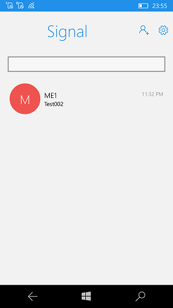

# Signal-WindowsMobile
Signal for Windows 10 Mobile 0.8.4

This solution is little "tuning" of "Signal for Windows 10" [https://github.com/signal-csharp/Signal-Windows] 
(target: Windows Mobile 10 build 15063)

## About Signal-Windows

This is an unofficial Signal client for the Universal Windows Platform. 
It is (currently) a hobby project in a very early stage of production, 
so expect bugs and non-backwards compatible changes.

## Status
Not complete (Device Linking demaged.)

## FAQ

### What can it do right now?
- register as a master device
- be linked as a slave
- add/edit contacts
- send and receive text messages

### What can I expect next?
- proper attachment handling
- syncing groups and contacts on linking
- a prettier interface

## I want to try it out but I'm not a developer
Sorry, this is RnD only project, not for production. :(

## Bug reports
Found a bug? Great! Open a pull request or an issue.

## Contributing

[See the contributing docs](CONTRIBUTING.md).

## Legal things
### License
MIT License.

AS-IS. No support. RnD only.